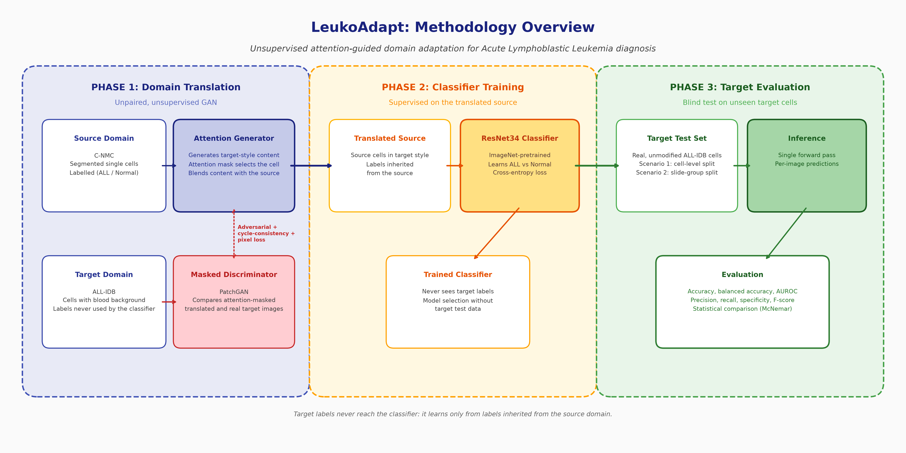
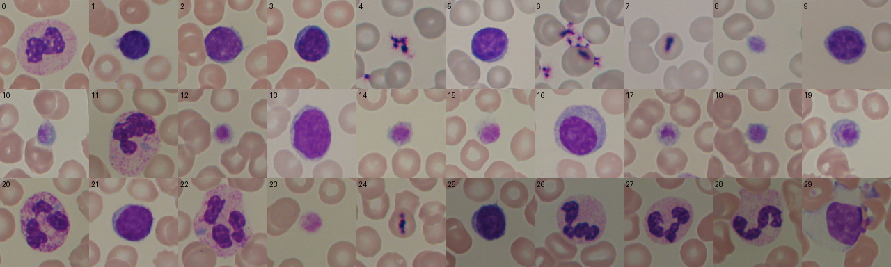
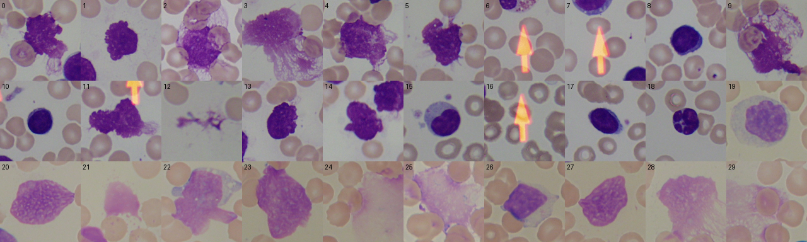
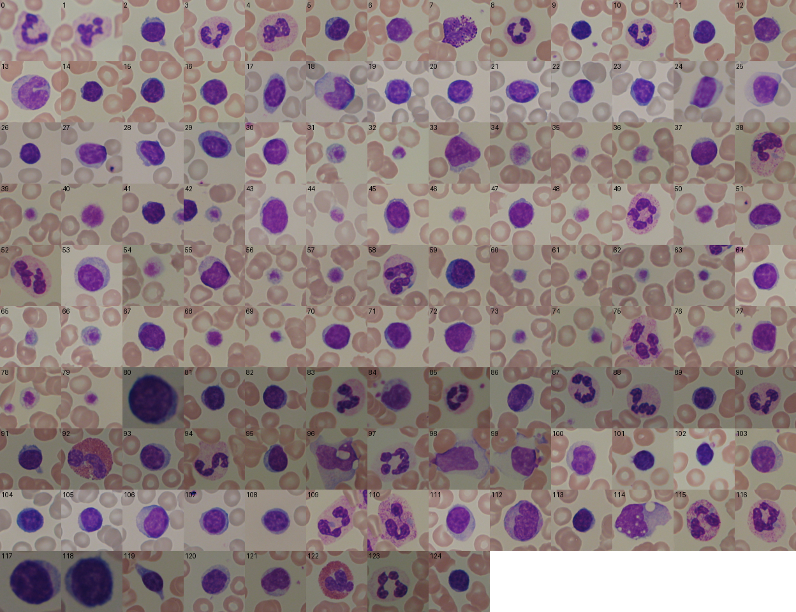

<div align="center">

# LeukoAdapt

### Adaptasi Domain Tanpa Supervisi Berpanduan Atensi untuk Diagnosis Leukemia Limfoblastik Akut (ALL)

[](https://www.python.org/)
[](https://pytorch.org/)
[](https://github.com/astral-sh/ruff)

<p align="center">
  Framework PyTorch yang menerjemahkan leukosit C-NMC hasil segmentasi ke dalam gaya visual apusan darah ALL-IDB menggunakan CycleGAN berpanduan atensi, kemudian melatih classifier yang diuji pada sel ALL-IDB asli yang belum pernah dilihatnya.
</p>

<p align="center"><a href="README.md">English</a> | <b>Bahasa Indonesia</b></p>

</div>

---

> [!NOTE]
> Repositori ini mereproduksi, sekaligus mengaudit, metode dari
> **Yusuf Yargı Baydilli (2025)**, *"Unsupervised attention-guided domain adaptation model for Acute Lymphocytic Leukemia (ALL) diagnosis"*, **Biomedical Signal Processing and Control**, Vol. 101, 107159. [DOI: 10.1016/j.bspc.2024.107159](https://doi.org/10.1016/j.bspc.2024.107159).
>
> **Skenario 1** mengikuti paper sedekat yang dimungkinkan oleh data. **Skenario 2** adalah split yang lebih ketat dan bebas kebocoran data yang ditambahkan oleh repositori ini. Setiap bagian di mana paper tidak dapat diikuti secara harfiah dicantumkan di [Bagian 5](#5-catatan-reproduksi-penyimpangan-dari-paper).

---

## Daftar Isi

- [1. Gambaran Umum](#1-gambaran-umum)
- [2. Metodologi](#2-metodologi)
- [3. Dataset](#3-dataset)
- [4. Skenario Evaluasi](#4-skenario-evaluasi)
- [5. Catatan Reproduksi: Penyimpangan dari Paper](#5-catatan-reproduksi-penyimpangan-dari-paper)
- [6. Struktur Repositori](#6-struktur-repositori)
- [7. Instalasi](#7-instalasi)
- [8. Penggunaan](#8-penggunaan)
- [9. Opsi Command-Line](#9-opsi-command-line)
- [10. Pengujian](#10-pengujian)
- [11. Referensi](#11-referensi)

---

## 1. Gambaran Umum

### A. Masalah: Pergeseran Domain Antar-Laboratorium

Classifier yang dilatih pada citra apusan darah dari satu laboratorium biasanya mengalami penurunan kinerja pada citra dari laboratorium lain, karena distribusi marginalnya berbeda ($P(X_s) \neq P(X_t)$):
- optik mikroskop dan perangkat keras kamera;
- durasi pewarnaan Jenner-Giemsa dan batch reagen;
- latar belakang: sel C-NMC disegmentasi di atas latar hitam, sedangkan sel ALL-IDB berada di antara sel darah merah.

Pelabelan dataset baru untuk setiap laboratorium memerlukan biaya besar, sehingga domain target diperlakukan sebagai **tidak berlabel**.

### B. Pendekatan

> [!TIP]
> **Analogi.** Kios A (C-NMC) menjual apel yang sudah dicuci di atas nampan bersih; Kios B (ALL-IDB) menjual apel yang sama di dalam keranjang jerami. Penyortir yang hanya dilatih di Kios A akan gagal di Kios B. GAN berperan sebagai adaptor yang mengemas ulang apel Kios A agar tampak seperti apel Kios B, tanpa mengubah apelnya sendiri, sehingga penyortir dapat dilatih dengan data berlabel dari Kios A dan tetap bekerja di Kios B.

---

## 2. Metodologi

<p align="center">
  
  <br><em>Gambar 1. Pipeline tiga fase: translasi domain tanpa supervisi, pelatihan classifier pada sumber hasil translasi, dan evaluasi buta pada domain target.</em>
</p>

### Fase 1: Translasi Domain Berpanduan Atensi (GAN)

- **Tujuan**: menerjemahkan sel sumber C-NMC berlabel ($s$) ke dalam gaya domain target ALL-IDB ($t$) tanpa mengubah diagnosisnya.
- **Generator berpanduan atensi ($G_{S \to T}$, $A_S$)**: sebuah encoder dengan atensi spasial setelah setiap blok konvolusi, enam residual block, dan sebuah decoder dengan skip connection menghasilkan citra konten $G(s)$. Modul atensi menghitung mask satu kanal dari citra tersebut, $s_a = \sigma\big(f_{7\times7}([\mathrm{AvgPool}(G(s)); \mathrm{MaxPool}(G(s))])\big)$, lalu memadukan:

  $$s' = s_a \odot G_{S \to T}(s) + (1 - s_a) \odot s$$

- **Cycle**: $F_{T \to S}$ dan $A_T$ memetakan $s'$ kembali ke $s''$. Hanya cycle $S \to T \to S$ dan discriminator target yang dilatih, sesuai dengan paper.
- **Discriminator PatchGAN ber-mask ($D_T$)**: membandingkan citra asli ber-mask $s_a \odot t$ dengan citra hasil translasi ber-mask $s_a \odot s'$ (Pers. 3). History buffer berukuran 50 citra menyimpan citra palsu yang sudah di-mask, sehingga setiap citra palsu tetap membawa mask yang digunakan saat citra tersebut dibangkitkan.
- **Fungsi objektif**: $\mathcal{L} = 0.5\,\mathcal{L}_{AGAN} + 10\,\lVert s - s'' \rVert_1 + 1\,\lVert s - s' \rVert_1$, dengan suku adversarial least-squares dan loss discriminator yang dibagi dua. Suku piksel tersebut merupakan self-regularisation SimGAN yang dirujuk oleh paper (ref. [105]).
- **Pelatihan**: 200 epoch, Adam ($\beta_1 = 0.5$, $\beta_2 = 0.999$), learning rate $10^{-4}$ yang menurun secara linear menuju 0 mulai epoch 100, augmentasi horizontal flip, serta kelas target yang diseimbangkan menjadi 1:1 dengan salinan hasil flip (paper Bagian 5.1.2).
- **Pemilihan checkpoint**: sebuah checkpoint dan preview grid (sumber / $s'$ / $s_a$) disimpan setiap 5 epoch. Paper mempertahankan checkpoint yang secara visual terbaik; berikan checkpoint tersebut melalui `--checkpoint_gan`.

### Fase 2: Pelatihan Classifier pada Sumber Hasil Translasi

- **Data**: 2,000 citra C-NMC hasil translasi $s'$, masing-masing mewarisi label dari citra sumbernya ($Y_s \in \{\text{ALL}, \text{Normal}\}$).
- **Model**: ResNet34 dengan bobot ImageNet.
- **Pelatihan**: 50 epoch, Adam, learning rate $10^{-3}$, batch size 32, cross-entropy, tanpa weight decay.
- **Pemilihan model**: epoch terakhir, sesuai dengan paper. Sebagai alternatif, `--source_val` memilih epoch berdasarkan sel C-NMC `fold_2` hasil translasi; data target tidak pernah digunakan untuk pemilihan.

### Fase 3: Evaluasi Buta pada Domain Target

- Classifier dijalankan satu kali pada sel uji ALL-IDB asli tanpa modifikasi yang belum pernah dilihatnya.
- `results.json` menyimpan TN, TP, FP, FN, akurasi beserta interval Wilson 95%, balanced accuracy, presisi, recall, spesifisitas, NPV, F-score, AUROC, angka yang sama dalam konvensi kolom Tabel 5 paper ([Bagian 5.B](#b-label-metrik-tabel-5)), serta prediksi per citra untuk McNemar test.
- **Referensi terpublikasi** (paper Tabel 5, model yang diusulkan, protokol Skenario 1): TN = 91, TP = 87, akurasi 0.8900, F-score 0.8878.

---

## 3. Dataset

### A. Domain Sumber: C-NMC 2019

Data training ISBI 2019 C-NMC berisi 10,661 sel tunggal tersegmentasi dalam tiga fold yang terpisah berdasarkan subject (subject-disjoint). Paper menggunakan 1,000 citra ALL + 1,000 citra Normal (HEM) tanpa menyebutkan fold-nya; repositori ini mengambil sampel dari `fold_0` secara bergiliran antar-subject sehingga tidak ada subject yang mendominasi (19 subject ALL dan 9 subject HEM terwakili).

| Fold | ALL | HEM | Penggunaan |
| :--- | :---: | :---: | :--- |
| `fold_0` | 2,397 | 1,130 | 1,000 ALL + 1,000 HEM **sumber training** |
| `fold_1` | 2,418 | 1,163 | Tidak digunakan |
| `fold_2` | 2,457 | 1,096 | 500 ALL + 500 HEM validasi opsional untuk `--source_val` (subject-disjoint terhadap data training) |

### B. Domain Target: Gambar ALL-IDB1, Hanya Anotasi Ahli

Seluruh patch target di-crop dari slide **ALL-IDB1** dengan satu prosedur yang sama (crop 257 x 257 yang berpusat pada centroid nukleus hasil penyempurnaan, lalu resize bikubik ke 128 x 128). Setiap label berasal dari anotasi dataset itu sendiri:

| Kelas | Sumber anotasi | Sel | Slide |
| :--- | :--- | :---: | :---: |
| ALL (blast) | Centroid blast `.xyc` ALL-IDB1 | 510 | 49 slide ALL |
| Normal | Crop `*_0.tif` ALL-IDB2 (*"the cell placed in the center of the image is not a blast"*, individu sehat), yang lokasinya pada slide sumber ALL-IDB1 ditemukan dengan template matching | 125 | 58 slide sehat |

- **ALL-IDB2 hanya digunakan sebagai anotasi.** Template matching mengonfirmasi bahwa seluruh 260 crop ALL-IDB2 dipotong dari slide ALL-IDB1 (korelasi ternormalisasi > 0.9 untuk setiap crop). Menambahkannya sebagai citra tambahan akan menduplikasi sel, dan meng-crop kedua kelas dari JPEG ALL-IDB1 yang sama mencegah classifier membedakan kelas berdasarkan format file (ALL-IDB2 berformat TIFF).
- **Duplikat dihapus.** `Im108_0.jpg` pada ALL-IDB1 merupakan salinan identik per piksel dari `Im093_0.jpg` dan tidak pernah digunakan. Lima crop Normal ALL-IDB2 mengulang sel yang sama (`Im222`-`Im227` vs `Im256`-`Im260`), sehingga 130 crop tersebut berisi 125 sel unik.
- **Provenans** (slide sumber, centroid, nama file ALL-IDB2, skor kecocokan, pembagian split) dicatat dalam [metadata_target_cells.json](data/processed/target_all_idb/metadata_target_cells.json).

### C. Sel Normal: Mengapa 125, Bukan 349 seperti di Paper

> [!IMPORTANT]
> Paper melaporkan 510 sel ALL + 349 sel Normal (Tabel 1) tanpa menyebutkan asal sel Normal tersebut. ALL-IDB1 hanya menganotasi blast, dan slide sehatnya hanya memuat sedikit sel darah putih: detektor berbasis pewarnaan menemukan sekitar 106 objek berukuran leukosit di sana, 98 di antaranya sudah termasuk dalam 125 sel ALL-IDB2. Dari 8 sisanya, dua merupakan gumpalan platelet, satu merupakan sepasang neutrofil yang saling bersentuhan, tiga berada pada slide duplikat `Im108_0`, dan dua tampak sebagai leukosit yang valid (`Im090_0`, `Im091_0`) tetapi tidak memiliki label dataset. **ALL-IDB tidak memiliki sumber 349 sel Normal yang berlabel benar**, sehingga repositori ini menggunakan 125 sel yang dilabeli oleh ahli.

**Rekonstruksi sebelumnya tidak andal.** Versi sebelumnya memenuhi 349 sel Normal dengan menjalankan detektor pewarnaan pada slide sehat (162 deteksi) lalu pada slide ALL di area yang jauh dari blast teranotasi (187 deteksi). Tiga puluh patch dengan jarak merata dari masing-masing sumber diperiksa (pemeriksaan visual oleh non-ahli):

<p align="center">
  
  <br><em>Gambar 2. Rekonstruksi lama, slide sehat (sampel 30, bernomor). Leukosit utuh bercampur dengan platelet dan fragmen kecil (misalnya 4, 6, 7, 8, 10, 12, 14).</em>
</p>

<p align="center">
  
  <br><em>Gambar 3. Rekonstruksi lama, slide ALL (sampel 30, bernomor). Sebagian besar berupa smudge cell, sel menyerupai blast, dan panah anotasi (6, 7, 16), yang tidak dapat dijamin normal karena berasal dari slide pasien.</em>
</p>

| Sumber patch Normal lama | Leukosit utuh | Platelet / fragmen | Smudge / sel rusak | Sel menyerupai blast | Panah anotasi / kosong | Ambigu |
| :--- | :---: | :---: | :---: | :---: | :---: | :---: |
| Slide sehat (162) | 17 / 30 | 13 / 30 | 0 | 0 | 0 | 0 |
| Slide ALL (187) | 5 / 30 | 0 | 12 / 30 | 6 / 30 | 5 / 30 | 2 / 30 |

**Set Normal saat ini** hanya menggunakan sel yang dilabeli oleh penulis dataset. Setiap patch berpusat pada sel yang dianotasi. Sekitar 27 di antaranya merupakan sel kecil dan pucat; sel-sel tersebut tetap dipertahankan karena dataset melabelinya sebagai "bukan blast", dan tidak ada label yang diubah berdasarkan penilaian subjektif dalam repositori ini.

<p align="center">
  
  <br><em>Gambar 4. Seluruh 125 patch Normal yang digunakan, di-crop dari ALL-IDB1 pada posisi anotasi ALL-IDB2.</em>
</p>

### D. Ringkasan Distribusi

| Domain | Partisi | ALL | Normal | Total | Peran |
| :--- | :--- | :---: | :---: | :---: | :--- |
| Sumber | `source_cnmc/train` | 1,000 | 1,000 | **2,000** | Citra berlabel yang ditranslasikan oleh GAN; data training classifier |
| Sumber | `source_cnmc/val` | 500 | 500 | **1,000** | Validasi opsional (`--source_val`) |
| Target, Skenario 1 | `target_all_idb/cell_level/train` | 410 | 25 | **435** | Pool target GAN |
| Target, Skenario 1 | `target_all_idb/cell_level/test` | 100 | 100 | **200** | Set test buta (protokol paper) |
| Target, Skenario 2 | `target_all_idb/slide_level/train` | 382 | 95 | **477** | Pool target GAN |
| Target, Skenario 2 | `target_all_idb/slide_level/test` | 113 | 25 | **138** | Set test buta pada kelompok slide yang belum pernah dilihat |

Label target hanya digunakan untuk menyeimbangkan pool target GAN melalui flip, sebagaimana dalam paper; classifier tidak pernah melihatnya.

---

## 4. Skenario Evaluasi

Kedua skenario menjalankan GAN, translasi, dan classifier yang persis sama; hanya split target yang berbeda. Selisih antara hasil keduanya memperkirakan seberapa besar split tingkat sel membuat metode tampak lebih baik daripada yang sebenarnya.

### A. Skenario 1: Split Tingkat Sel (Protokol Paper)

- Split acak terstratifikasi dengan seed atas **sel**: 100 ALL + 100 Normal untuk pengujian, seperti dalam paper; sisanya, 410 ALL + 25 Normal, membentuk pool target GAN (paper: 249 Normal, lihat [Bagian 3.C](#c-sel-normal-mengapa-125-bukan-349-seperti-di-paper)).
- Seluruh 510 blast `.xyc` dipertahankan, seperti dalam paper. Oleh karena itu, sel dari satu foto dapat jatuh ke kedua sisi, dan 5 sel fisik yang difoto dua kali memiliki satu salinan di train dan satu salinan di test.

### B. Skenario 2: Split Grup Slide (Bebas Kebocoran)

**1. Bidang pandang yang tumpang tindih dikelompokkan.** ALL-IDB1 berisi foto-foto bidang yang tumpang tindih dari apusan yang sama, yang diambil ulang dengan eksposur berbeda (misalnya, `Im036_0` dan `Im103_0` menampilkan neutrofil yang sama dengan pergeseran 152 px). [slide_overlap.py](src/data/slide_overlap.py) memotong grid template 5 x 5 dari setiap slide pada resolusi 1/8 dan mencocokkannya, dengan normalised cross-correlation > 0.9, terhadap setiap slide dengan ukuran dan kelas yang sama. Skrip ini menemukan **15 pasangan yang tumpang tindih** yang membentuk **8 grup**, dan masing-masing grup ditempatkan ke train atau test secara utuh:

| Grup | Slide | Kelas |
| :--- | :--- | :--- |
| 1 | `Im009_1`, `Im010_1`, `Im011_1` | ALL |
| 2 | `Im013_1`, `Im014_1`, `Im015_1` | ALL |
| 3 | `Im018_1`, `Im019_1` | ALL |
| 4 | `Im020_1`, `Im021_1`, `Im022_1` | ALL |
| 5 | `Im036_0`, `Im102_0`, `Im103_0` | Sehat |
| 6 | `Im038_0`, `Im039_0`, `Im044_0` | Sehat |
| 7 | `Im078_0`, `Im089_0` | Sehat |
| 8 | `Im094_0`, `Im095_0` | Sehat |

Pencarian ini memerlukan waktu sekitar 10 menit dan hasilnya di-cache di `data/processed/target_all_idb/slide_overlaps.json`; hapus file tersebut untuk mengulanginya.

**2. Setiap sel fisik dihitung satu kali.** Dengan menggunakan offset dari pasangan yang tumpang tindih, sel beranotasi yang terpetakan dalam jarak 40 px dari sel berkelas sama pada slide pasangannya dianggap sebagai sel fisik yang sama. **20 salinan semacam itu** (15 ALL, 5 Normal) dikeluarkan (`"scenario_2_split": "duplicate"` dalam metadata), sehingga tersisa 495 sel unik ALL dan 120 sel unik Normal.

**3. Grup test diambil per stratum.** ALL-IDB1 memiliki dua format akuisisi: `Im001_1`-`Im033_1` berukuran 1712 x 1368 px, sedangkan slide ALL lainnya dan slide sehat berukuran 2592 x 1944 px (satu slide sehat berukuran 1226 x 652 px). Inti blast memiliki ukuran yang serupa pada kedua format (median luas sekitar 22,500 vs 21,100 px), tetapi set test harus mencakup keduanya. Untuk setiap stratum (kelas, ukuran citra), grup slide diacak dengan seed dan dipindahkan ke set test hingga set tersebut memuat sedikitnya 20% sel unik dari stratum tersebut.

| Stratum | Train | Test | Salinan yang dikeluarkan |
| :--- | :---: | :---: | :---: |
| ALL, 1712 x 1368 | 156 | 49 | 15 |
| ALL, 2592 x 1944 | 226 | 64 | 0 |
| Normal, 2592 x 1944 | 95 | 24 | 5 |
| Normal, 1226 x 652 | 0 | 1 | 0 |
| **Total** | **477** (382 ALL + 95 Normal) | **138** (113 ALL + 25 Normal) | **20** |

Slide test: `Im003_1`, `Im005_1`, `Im016_1`, `Im048_1`, `Im049_1`, `Im052_1`, `Im056_1` (ALL) dan `Im037_0`, `Im041_0`, `Im043_0`, `Im070_0`, `Im076_0`, `Im080_0`, `Im087_0`, `Im092_0`, `Im101_0`, `Im105_0`, `Im107_0` (sehat).

**4. Pemeriksaan.** `extract_all_idb.py` memunculkan error jika sebuah grup slide muncul di kedua sisi, dan [test_splits.py](tests/test_splits.py) memverifikasi pada metadata yang dihasilkan bahwa tidak ada grup slide maupun sel fisik yang melintasi split.

**5. Membaca hasil.**
- Set test tidak seimbang (113 ALL vs 25 Normal), sehingga **balanced accuracy dan AUROC** menjadi metrik utama: memprediksi ALL untuk setiap sel saja sudah menghasilkan accuracy biasa sebesar 81.9%.
- Wilson interval 95% dalam `results.json` menunjukkan ketidakpastian dari set test yang hanya berisi 138 sel.
- `--source_val` direkomendasikan di sini, agar tidak ada data target yang memengaruhi pemilihan model.

**6. Keterbatasan.** ALL-IDB1 tidak memiliki ID pasien. Pengelompokan menghilangkan kebocoran yang terlihat pada piksel, tetapi foto-foto berbeda yang tidak tumpang tindih dari satu pasien masih dapat jatuh ke kedua sisi. Skenario 2 bebas kebocoran pada tingkat foto dan sel fisik, tetapi tidak dijamin bebas kebocoran pada tingkat pasien.

---

## 5. Catatan Reproduksi: Penyimpangan dari Paper

| Topik | Paper | Repositori ini | Alasan |
| :--- | :--- | :--- | :--- |
| Objektif GAN | Pers. 3 dengan $s_a \odot t$ vs $s_a \odot s'$ | Diimplementasikan secara literal (default); varian melalui `--real_mask`, `--lambda_pixel` | Objektif literal mengalami collapse pada data ini ([5.A](#a-objektif-gan-literal-mengalami-collapse)) |
| Sel Normal | 349, sumber tidak disebutkan | 125 sel berlabel pakar | Tidak ada sumber lain dengan label yang benar ([3.C](#c-sel-normal-mengapa-125-bukan-349-seperti-di-paper)) |
| Pool target Skenario 1 | 410 ALL + 249 Normal | 410 ALL + 25 Normal | Protokol test (100 + 100) dipertahankan persis |
| Fold C-NMC | Tidak disebutkan | `fold_0`, round-robin per subjek | Pilihan yang dapat direproduksi |
| Label Tabel 5 | Kolom Precision / Recall / Specificity | Metrik yang benar ditambah konvensi paper | Kolom-kolomnya salah label ([5.B](#b-label-metrik-tabel-5)) |
| Detail classifier | Optimiser dan pretraining tidak disebutkan | Adam, bobot ImageNet, tanpa weight decay | Default yang umum |
| Presisi numerik | Tidak disebutkan | Mixed precision FP16 (`--no_amp` untuk menonaktifkan) | Muat pada GPU 4 GB; tidak mengubah metode |

### A. Objektif GAN Literal Mengalami Collapse

> [!WARNING]
> Karena input real dan fake bagi discriminator berbagi mask yang sama, $s_a$, mask yang tertutup ($s_a = 0$) membuat kedua input bernilai nol sehingga $D_T$ tidak lagi dapat membedakan keduanya, sementara pixel loss dan cycle loss sama-sama mencapai 0 pada $s' = s$. Pada C-NMC $\rightarrow$ ALL-IDB, optimum ini tercapai dalam satu epoch: checkpoint 200 epoch dari implementasi asli memiliki $s_a = 0.000$ di seluruh bagian. Uji coba dua epoch (4,000 step, FP32) mengalami collapse untuk setiap interpretasi di bawah ini kecuali satu, bahkan dengan $\lambda_{pixel} = 0$.
>
> | Input real ke $D_T$ (`--real_mask`) | $\lambda_{pixel}$ | Rerata mask | Rerata $\lvert s' - s \rvert$ | Hasil |
> | :--- | :---: | :---: | :---: | :--- |
> | `source`: $s_a \odot t$ (Pers. 3, **default**) | 1.0 | 0.000 | 0.000 | Collapse ($s' = s$) |
> | `source`: $s_a \odot t$ | 0.0 / 0.1 | 0.000 | 0.000 | Collapse |
> | `target`: $t_a \odot t$, $t_a = A_T(t, F(t))$ (UAIT [21]) | 1.0 | 0.013 | 0.003 | Collapse |
> | `target`: $t_a \odot t$ | 0.1 | 0.214 | 0.141 | Tidak collapse, tetapi muncul artefak latar belakang biru |
> | `none`: $t$ penuh | 1.0 | 0.053 | 0.006 | Collapse |
>
> Oleh karena itu, run default mengikuti paper dan melaporkan collapse tersebut: sebuah `WARNING` pada setiap epoch dan `"collapsed": true` di checkpoint. Dengan $s' = s$, classifier secara efektif dilatih secara source-only.

### B. Label Metrik Tabel 5

Kolom-kolom Tabel 5 pada paper salah label. Berdasarkan confusion matrix dari paper itu sendiri untuk model yang diusulkan (TN = 91, TP = 87 pada 100 + 100 sel test):

| Kolom paper | Nilai tercetak | Besaran sebenarnya | Nilai yang benar dari metrik yang dimaksud |
| :--- | :---: | :--- | :---: |
| Precision | 0.8700 | Recall $TP/(TP+FN)$ | 0.9063 |
| Recall | 0.9063 | Precision $TP/(TP+FP)$ | 0.8700 |
| Specificity | 0.8750 | NPV $TN/(TN+FN)$ | 0.9100 |

Accuracy (0.8900) dan F-score (0.8878) tidak terpengaruh. `results.json` menyimpan metrik yang benar di `test_metrics` dan konvensi paper di `test_metrics_paper_table5_columns`; [test_metrics.py](tests/test_metrics.py) mereproduksi baris pada paper tersebut.

---

## 6. Struktur Repositori

```text
ALL-IDB-Generalization/
├── configs/
│   └── config.yaml                  # Hyperparameter acuan (dokumentasi; train.py menggunakan opsi CLI)
├── data/
│   ├── raw/
│   │   ├── ALL-IDB/                 # ALL_IDB1 (slide .jpg, centroid blast .xyc), ALL_IDB2 (crop .tif)
│   │   └── C-NMC_2019/              # fold_0, fold_1, fold_2
│   └── processed/                   # Patch 128 x 128
│       ├── source_cnmc/             # train (fold_0) dan val (fold_2)
│       └── target_all_idb/
│           ├── cell_level/          # Skenario 1
│           ├── slide_level/         # Skenario 2
│           ├── metadata_target_cells.json
│           └── slide_overlaps.json  # Cache hasil pencarian tumpang-tindih
├── docs/
│   ├── generate_methodology_diagram.py
│   └── assets/                      # Gambar 1-4
├── src/
│   ├── data/
│   │   ├── dataset.py               # Dataset tidak berpasangan (GAN) dan berlabel (classifier)
│   │   ├── sample_cnmc.py           # Pengambilan sampel C-NMC
│   │   ├── extract_all_idb.py       # Pemotongan ALL-IDB dan kedua pembagian data
│   │   ├── slide_overlap.py         # Deteksi bidang pandang yang tumpang-tindih
│   │   └── stain_norm.py            # Baseline Reinhard
│   ├── models/
│   │   ├── attention.py             # Spatial attention dan fusi attention (A_S, A_T)
│   │   ├── generator.py             # Generator attention
│   │   ├── discriminator.py         # PatchGAN
│   │   ├── cyclegan.py              # Fungsi loss Pers. 6 / Pers. 8
│   │   └── classifier.py            # ResNet34
│   ├── training/
│   │   ├── train_gan.py             # Pelatihan GAN, checkpoint, pratinjau, pemeriksaan collapse
│   │   ├── translate.py             # Translasi sumber
│   │   └── train_classifier.py      # Pelatihan classifier dan uji buta
│   └── utils/
│       ├── metrics.py               # Metrik klasifikasi, pemetaan Tabel 5, PSNR
│       ├── image_pool.py            # Buffer riwayat
│       └── lightning_logger.py      # Keluaran terminal
├── tests/                           # Uji unit dan uji integritas data
├── PRD.md
├── pyproject.toml                   # Konfigurasi Ruff
├── requirements.txt
└── train.py                         # Titik masuk command-line
```

---

## 7. Instalasi

Lingkungan Python 3.11 diharapkan tersedia di `.venv` (Windows PowerShell):

```powershell
.\.venv\Scripts\Activate.ps1
```

Pada lingkungan baru:

```bash
pip install torch torchvision --index-url https://download.pytorch.org/whl/cu130
pip install -r requirements.txt
```

Pengaturan bawaan (batch size GAN 1, mixed precision) cukup untuk GPU 4 GB; satu epoch GAN memerlukan sekitar dua menit pada GPU RTX 3050 Laptop.

---

## 8. Penggunaan

### A. Menyiapkan Data

Tempatkan dataset mentah seperti yang ditunjukkan pada [Bagian 6](#6-struktur-repositori), kemudian:

```bash
python src/data/sample_cnmc.py       # Set train/val sumber C-NMC
python src/data/extract_all_idb.py   # Sel target ALL-IDB dan kedua skenario (eksekusi pertama ~10 menit untuk pencarian tumpang-tindih)
```

### B. Menjalankan Skenario

```bash
# Skenario 1 (protokol paper): GAN -> translasi -> classifier -> uji buta
python train.py --stage all --scenario cell_level

# Skenario 2 (bebas kebocoran), dengan pemilihan model pada set validasi C-NMC
python train.py --stage all --scenario slide_level --source_val
```

Setiap stage juga dapat dijalankan secara terpisah:

```bash
python train.py --stage gan --scenario cell_level
python train.py --stage translate --scenario cell_level --checkpoint_gan checkpoints/cyclegan_cell_level/attention_cyclegan_epoch_150.pth
python train.py --stage classifier --scenario cell_level
```

Tanpa `--checkpoint_gan`, translasi menggunakan checkpoint terbaru. Untuk mengikuti pemilihan visual sebagaimana dalam paper, periksa terlebih dahulu `checkpoints/cyclegan_<scenario>/preview_epoch_*.png`.

### C. Baseline

```bash
python train.py --stage baseline --baseline source_only --scenario cell_level        # baris "Source only" pada paper
python train.py --stage baseline --baseline reinhard --scenario cell_level           # normalisasi warna
python train.py --stage baseline --baseline target_supervised --scenario cell_level  # sel latih target berlabel
```

### D. Keluaran

| Path | Isi |
| :--- | :--- |
| `checkpoints/cyclegan_<scenario>/` | Checkpoint GAN dan preview grid setiap 5 epoch |
| `data/processed/translated_source/<scenario>/` | Citra C-NMC hasil translasi |
| `checkpoints/classifier_<scenario>/results.json` | Metrik uji, tampilan Tabel 5, prediksi per citra |
| `checkpoints/classifier_<scenario>/last_classifier.pth` | Bobot classifier (`selected_classifier.pth` dengan `--source_val`) |
| `checkpoints/baseline_<name>_<scenario>/` | Hasil baseline |

---

## 9. Opsi Command-Line

| Opsi | Bawaan | Deskripsi |
| :--- | :--- | :--- |
| `--stage` | `all` | `gan`, `translate`, `classifier`, `baseline`, atau `all` (GAN + translasi + classifier) |
| `--scenario` | `cell_level` | `cell_level` (Skenario 1) atau `slide_level` (Skenario 2) |
| `--baseline` | none | `source_only`, `reinhard`, atau `target_supervised`; wajib untuk `--stage baseline` |
| `--epochs_gan` | `200` | Jumlah epoch GAN |
| `--decay_epoch_gan` | `100` | Epoch saat peluruhan linear learning rate dimulai |
| `--epochs_clf` | `50` | Jumlah epoch classifier |
| `--batch_size_gan` | `1` | Batch size GAN |
| `--batch_size_clf` | `32` | Batch size classifier |
| `--lr_gan` | `0.0001` | Learning rate GAN (Adam, $\beta_1 = 0.5$, $\beta_2 = 0.999$) |
| `--lr_clf` | `0.001` | Learning rate classifier (Adam) |
| `--lambda_gan` | `0.5` | Bobot adversarial loss |
| `--lambda_cycle` | `10.0` | Bobot cycle-consistency loss |
| `--lambda_pixel` | `1.0` | Bobot pixel loss |
| `--real_mask` | `source` | Masukan $D_T$ riil: `source` ($s_a \odot t$, paper), `target` ($t_a \odot t$), `none` ($t$ utuh) |
| `--no_target_balance` | off | Tidak menambah kelas target minoritas dengan salinan hasil flip |
| `--source_val` | off | Memilih epoch classifier berdasarkan C-NMC `fold_2` hasil translasi alih-alih menggunakan epoch terakhir |
| `--checkpoint_gan` | latest | Checkpoint GAN yang digunakan untuk translasi |
| `--seed` | `42` | Seed acak |
| `--no_amp` | off | Menonaktifkan mixed precision |
| `--device` | `cuda` jika tersedia | `cuda` atau `cpu` |

---

## 10. Pengujian

```bash
pytest -v tests/
ruff check .
ruff format --check src tests train.py docs
```

Ke-14 pengujian mencakup bentuk keluaran dan fungsi loss model, pemuatan data dan penyeimbangan target, pemetaan metrik Tabel 5, serta pengelompokan dan pemeriksaan kebocoran pada Skenario 2.

---

## 11. Referensi

1. **Baydilli, Y. Y. (2025)**. *Unsupervised attention-guided domain adaptation model for Acute Lymphocytic Leukemia (ALL) diagnosis*. Biomedical Signal Processing and Control, 101, 107159.
2. **Labati, R. D., Piuri, V., & Scotti, F. (2011)**. *All-IDB: The acute lymphoblastic leukemia image database for image processing*. In 18th IEEE International Conference on Image Processing (ICIP), pp. 2045–2048.
3. **Gupta, A., et al. (2019)**. *ISBI 2019 C-NMC Challenge: Classification of Normal vs Malignant Cells in B-ALL White Blood Cancer Microscopic Images*. TCIA.
4. **Alami Mejjati, Y., et al. (2018)**. *Unsupervised Attention-guided Image-to-Image Translation*. NeurIPS 31.
5. **Shrivastava, A., et al. (2017)**. *Learning from Simulated and Unsupervised Images through Adversarial Training*. CVPR.
