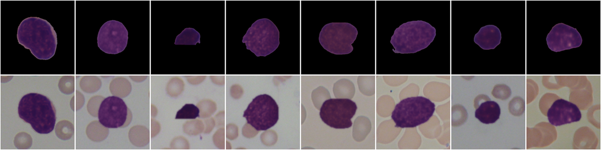

<div align="center">

# LeukoAdapt

### Adaptasi Domain Tanpa Supervisi Berpanduan Atensi untuk Diagnosis Leukemia Limfoblastik Akut (ALL)

[](https://www.python.org/)
[](https://pytorch.org/)
[](https://github.com/astral-sh/ruff)

<p align="center">
  Kerangka kerja PyTorch yang mentranslasikan leukosit C-NMC tersegmentasi ke dalam gaya visual apusan darah ALL-IDB menggunakan CycleGAN berpanduan atensi, kemudian melatih classifier yang diuji pada sel ALL-IDB nyata yang belum pernah dilihatnya.
</p>

<p align="center"><a href="README.md">English</a> | <b>Bahasa Indonesia</b></p>

</div>

---

> [!NOTE]
> Repositori ini merupakan **versi modifikasi** dari metode
> **Yusuf Yargı Baydilli (2025)**, *"Unsupervised attention-guided domain adaptation model for Acute Lymphocytic Leukemia (ALL) diagnosis"*, **Biomedical Signal Processing and Control**, Vol. 101, 107159. [DOI: 10.1016/j.bspc.2024.107159](https://doi.org/10.1016/j.bspc.2024.107159).
>
> Jika diimplementasikan persis seperti yang tertulis, GAN pada paper mengalami collapse menjadi identity mapping pada data ini. Tiga perubahan membuatnya berfungsi: sel sumber ditempelkan pada latar belakang ALL-IDB nyata, generator mengubah gaya wilayah sel yang sudah diketahui alih-alih menggunakan attention mask yang dipelajari, dan discriminator melihat citra secara utuh; selebihnya mengikuti paper. GAN versi paper secara harfiah tetap tersedia melalui `--fusion learned --real_mask source --no_composite --allow_collapse`. **Skenario 1** menggunakan protokol evaluasi paper; **Skenario 2** adalah split yang lebih ketat dan bebas kebocoran data. Seluruh penyimpangan dicantumkan di [Bagian 5](#5-catatan-reproduksi-penyimpangan-dari-paper).

---

## Daftar Isi

- [1. Gambaran Umum](#1-gambaran-umum)
- [2. Metodologi](#2-metodologi)
- [3. Dataset](#3-dataset)
- [4. Skenario Evaluasi](#4-skenario-evaluasi)
- [5. Catatan Reproduksi: Penyimpangan dari Paper](#5-catatan-reproduksi-penyimpangan-dari-paper)
- [6. Struktur Repositori](#6-struktur-repositori)
- [7. Instalasi](#7-instalasi)
- [8. Penggunaan](#8-penggunaan)
- [9. Opsi Command-Line](#9-opsi-command-line)
- [10. Pengujian](#10-pengujian)
- [11. Referensi](#11-referensi)

---

## 1. Gambaran Umum

### A. Masalah: Pergeseran Domain Antar-Laboratorium

Classifier yang dilatih pada citra apusan darah dari satu laboratorium biasanya mengalami penurunan kinerja pada citra dari laboratorium lain, karena distribusi marginalnya berbeda ($P(X_s) \neq P(X_t)$):
- optik mikroskop dan perangkat keras kamera;
- durasi pewarnaan Jenner-Giemsa dan batch reagen;
- latar belakang: sel C-NMC disegmentasi di atas latar hitam, sedangkan sel ALL-IDB berada di antara sel darah merah.

Pelabelan dataset baru untuk setiap laboratorium memakan biaya besar, sehingga domain target diperlakukan sebagai **tidak berlabel**.

### B. Pendekatan

> [!TIP]
> **Analogi.** Lapak A (C-NMC) menjual apel yang sudah dicuci di atas nampan bersih; Lapak B (ALL-IDB) menjual apel yang sama di dalam keranjang jerami. Penyortir yang hanya dilatih di Lapak A akan gagal di Lapak B. GAN berperan sebagai adaptor yang mengemas ulang apel Lapak A agar tampil seperti apel Lapak B, tanpa mengubah apelnya sendiri, sehingga penyortir dapat dilatih dengan data berlabel dari Lapak A dan tetap berfungsi di Lapak B.

---

## 2. Metodologi

<p align="center">
  
  <br><em>Gambar 1. Pipeline tiga fase: translasi domain tanpa supervisi, pelatihan classifier pada sumber hasil translasi, dan evaluasi buta pada domain target.</em>
</p>

### Fase 1: Translasi Domain Berpanduan Atensi (GAN)

- **Tujuan**: mentranslasikan sel sumber C-NMC berlabel ($s$) ke dalam gaya domain target ALL-IDB ($t$) tanpa mengubah diagnosisnya.
- **Komposisi latar belakang** (modifikasi): setiap sel sumber ditempelkan pada patch latar belakang ALL-IDB nyata yang bebas sel sebelum translasi ([Bagian 3.E](#e-bank-latar-target)), sehingga GAN mengadaptasi sel alih-alih mencoba melukiskan sel darah merah ke dalam area hitam.
- **Generator atensi ($G_{S \to T}$)**: encoder dengan spatial attention setelah setiap blok konvolusi (Algoritma 2), enam residual block, dan decoder dengan skip connection menghasilkan citra konten $G(s)$.
- **Fusion mask** (modifikasi): paper mempelajari mask pemaduan $s_a = \sigma\big(f_{7\times7}([\mathrm{AvgPool}(G(s)); \mathrm{MaxPool}(G(s))])\big)$ (Algoritma 1, $A_S$). Mask yang tertutup memenuhi seluruh reconstruction loss sekaligus, dan pada data ini mask tersebut menutup selama pelatihan ([Bagian 5.A](#a-mengapa-gan-dimodifikasi)). Karena sel C-NMC telah tersegmentasi, wilayah sel sudah diketahui: $s_a$ adalah mask sel yang diperlebar dengan tepi 3 px, sehingga generator mengubah gaya sel dan memadukan batasnya, sementara patch latar belakang tetap tidak tersentuh:

  $$s' = s_a \odot G_{S \to T}(s) + (1 - s_a) \odot s$$

- **Cycle**: $F_{T \to S}$ dan $A_T$ memetakan $s'$ kembali ke $s''$. Hanya cycle $S \to T \to S$ dan discriminator target yang dilatih, sesuai paper.
- **Discriminator PatchGAN ($D_T$)** (modifikasi): membandingkan citra hasil translasi $s'$ secara utuh dengan citra target nyata $t$ secara utuh. Pers. 3 pada paper membandingkan $s_a \odot s'$ dengan $s_a \odot t$, yang memiliki optimum degeneratif ([Bagian 5.A](#a-mengapa-gan-dimodifikasi)). History buffer berisi 50 citra menstabilkan discriminator.
- **Fungsi objektif** (sesuai paper): $\mathcal{L} = 0.5\,\mathcal{L}_{GAN} + 10\,\lVert s - s'' \rVert_1 + 1\,\lVert s - s' \rVert_1$, dengan suku adversarial least-squares dan loss discriminator dibagi dua. Suku piksel merupakan self-regularisation SimGAN yang dirujuk oleh paper (ref. [105]).
- **Pelatihan** (sesuai paper): 200 epoch, Adam ($\beta_1 = 0.5$, $\beta_2 = 0.999$), learning rate $10^{-4}$ yang menurun secara linear hingga 0 mulai epoch 100, augmentasi flip horizontal, serta kelas target diseimbangkan menjadi 1:1 dengan salinan hasil flip (paper Bagian 5.1.2).
- **Pemilihan checkpoint**: checkpoint dan preview grid (sumber komposit / $s'$ / $s_a$) disimpan setiap 5 epoch. Paper mempertahankan checkpoint yang secara visual terbaik; berikan checkpoint tersebut melalui `--checkpoint_gan`. Sebuah `WARNING` dicetak ketika translasi mengalami collapse ($s' \approx s$ di dalam $s_a$), dan pelatihan dihentikan setelah 3 epoch yang collapse kecuali `--allow_collapse` diberikan.

### Fase 2: Pelatihan Classifier pada Sumber Hasil Translasi

- **Data**: 2,000 citra C-NMC hasil translasi $s'$, masing-masing mewarisi label dari citra sumbernya ($Y_s \in \{\text{ALL}, \text{Normal}\}$).
- **Model**: ResNet34 dengan bobot ImageNet.
- **Pelatihan**: 50 epoch, Adam, learning rate $10^{-3}$, batch size 32, cross-entropy, tanpa weight decay.
- **Pemilihan model**: epoch terakhir, sesuai paper. Sebagai alternatif, `--source_val` memilih epoch berdasarkan sel C-NMC `fold_2` hasil translasi; data target tidak pernah digunakan untuk pemilihan.

### Fase 3: Evaluasi Buta pada Domain Target

- Classifier dijalankan satu kali pada sel test ALL-IDB nyata yang tidak dimodifikasi dan belum pernah dilihatnya.
- `results.json` menyimpan TN, TP, FP, FN, akurasi dengan interval Wilson 95%, balanced accuracy, precision, recall, spesifisitas, NPV, F-score, AUROC, angka yang sama dalam konvensi kolom Tabel 5 paper ([Bagian 5.B](#b-label-metrik-tabel-5)), serta prediksi per citra.
- `python main.py evaluate` menghimpun seluruh run ke dalam satu tabel perbandingan dan menjalankan McNemar test berpasangan, sesuai Bagian 5.1.3 paper.
- **Referensi terpublikasi** (Tabel 5 paper, model yang diusulkan, protokol Skenario 1): TN = 91, TP = 87, akurasi 0.8900, F-score 0.8878.

---

## 3. Dataset

### A. Domain Sumber: C-NMC 2019

Data training ISBI 2019 C-NMC berisi 10,661 sel tunggal tersegmentasi dalam tiga fold yang terpisah per subject. Paper menggunakan 1,000 gambar ALL + 1,000 gambar Normal (HEM) tanpa menyebutkan fold yang dipakai; repositori ini mengambil sampel dari `fold_0` dengan menggilir subject agar tidak ada subject yang mendominasi (19 subject ALL dan 9 subject HEM terwakili).

| Fold | ALL | HEM | Penggunaan |
| :--- | :---: | :---: | :--- |
| `fold_0` | 2,397 | 1,130 | 1,000 ALL + 1,000 HEM **sumber training** |
| `fold_1` | 2,418 | 1,163 | Tidak digunakan |
| `fold_2` | 2,457 | 1,096 | 500 ALL + 500 HEM validasi opsional untuk `--source_val` (subject terpisah dari data training) |

### B. Domain Target: Gambar ALL-IDB1, Hanya Anotasi Ahli

Semua patch target di-crop dari slide **ALL-IDB1** dengan satu prosedur yang sama (crop 257 x 257 yang berpusat pada centroid nukleus yang telah disempurnakan, lalu resize bikubik ke 128 x 128). Setiap label berasal dari anotasi dataset itu sendiri:

| Kelas | Sumber anotasi | Sel | Slide |
| :--- | :--- | :---: | :---: |
| ALL (blast) | Centroid blast `.xyc` ALL-IDB1 | 510 | 49 slide ALL |
| Normal | Crop `*_0.tif` ALL-IDB2 (*"the cell placed in the center of the image is not a blast"*, individu sehat), yang lokasinya pada slide sumber ALL-IDB1 ditemukan dengan template matching | 125 | 58 slide sehat |

- **ALL-IDB2 hanya digunakan sebagai anotasi.** Template matching menunjukkan bahwa seluruh 260 crop ALL-IDB2 dipotong dari slide ALL-IDB1 (korelasi ternormalisasi > 0.9 untuk setiap crop). Menambahkannya sebagai gambar tambahan akan menduplikasi sel, dan meng-crop kedua kelas dari JPEG ALL-IDB1 yang sama mencegah classifier membedakan kelas berdasarkan format file (ALL-IDB2 berformat TIFF).
- **Duplikat dihapus.** `Im108_0.jpg` pada ALL-IDB1 merupakan salinan identik per piksel dari `Im093_0.jpg` dan tidak pernah digunakan. Lima crop Normal ALL-IDB2 mengulang sel yang sama (`Im222`-`Im227` vs `Im256`-`Im260`), sehingga 130 crop tersebut berisi 125 sel unik.
- **Asal-usul data** (slide sumber, centroid, nama file ALL-IDB2, skor kecocokan, penetapan split) dicatat dalam `data/processed/target_all_idb/metadata_target_cells.json`.

### C. Sel Normal: Mengapa 125, Bukan 349 seperti di Paper

> [!IMPORTANT]
> Paper melaporkan 510 sel ALL + 349 sel Normal (Tabel 1) tanpa menjelaskan asal sel Normal tersebut. ALL-IDB1 hanya menganotasi blast, dan slide sehatnya hanya memuat sedikit sel darah putih: detektor berbasis pewarnaan menemukan sekitar 106 objek berukuran leukosit di sana, 98 di antaranya sudah termasuk dalam 125 sel ALL-IDB2. Dari 8 sisanya, dua merupakan gumpalan platelet, satu merupakan sepasang neutrofil yang bersentuhan, tiga berada pada slide duplikat `Im108_0`, dan dua tampak seperti leukosit yang valid (`Im090_0`, `Im091_0`) tetapi tidak memiliki label dataset. **ALL-IDB tidak memiliki sumber 349 sel Normal yang berlabel benar**, sehingga repositori ini menggunakan 125 sel yang dilabeli oleh ahli.

**Rekonstruksi sebelumnya tidak dapat diandalkan.** Versi sebelumnya mengisi 349 sel Normal dengan menjalankan detektor pewarnaan pada slide sehat (162 deteksi), lalu pada slide ALL di area yang jauh dari blast teranotasi (187 deteksi). Tiga puluh patch dengan jarak merata dari setiap sumber diperiksa (pemeriksaan visual oleh non-ahli):

<p align="center">
  
  <br><em>Gambar 2. Rekonstruksi lama, slide sehat (sampel 30, bernomor). Leukosit utuh bercampur dengan platelet dan fragmen kecil (misalnya 4, 6, 7, 8, 10, 12, 14).</em>
</p>

<p align="center">
  
  <br><em>Gambar 3. Rekonstruksi lama, slide ALL (sampel 30, bernomor). Sebagian besar berupa smudge cell, sel mirip blast, dan panah anotasi (6, 7, 16), yang kenormalannya tidak dapat dijamin pada slide pasien.</em>
</p>

| Sumber patch Normal lama | Leukosit utuh | Platelet / fragmen | Smudge / sel rusak | Sel mirip blast | Panah anotasi / kosong | Ambigu |
| :--- | :---: | :---: | :---: | :---: | :---: | :---: |
| Slide sehat (162) | 17 / 30 | 13 / 30 | 0 | 0 | 0 | 0 |
| Slide ALL (187) | 5 / 30 | 0 | 12 / 30 | 6 / 30 | 5 / 30 | 2 / 30 |

**Set Normal saat ini** hanya menggunakan sel yang dilabeli oleh penyusun dataset. Setiap patch berpusat pada sel yang dianotasi. Sekitar 27 di antaranya merupakan sel kecil dan pucat; sel-sel ini tetap dipertahankan karena dataset melabelinya sebagai "not a blast", dan tidak ada label yang diubah berdasarkan penilaian subjektif dalam repositori ini.

<p align="center">
  
  <br><em>Gambar 4. Seluruh 125 patch Normal yang digunakan, di-crop dari ALL-IDB1 pada posisi anotasi ALL-IDB2.</em>
</p>

### D. Ringkasan Distribusi

| Domain | Partisi | ALL | Normal | Total | Peran |
| :--- | :--- | :---: | :---: | :---: | :--- |
| Sumber | `source_cnmc/train` | 1,000 | 1,000 | **2,000** | Gambar berlabel yang ditranslasikan oleh GAN; data training classifier |
| Sumber | `source_cnmc/val` | 500 | 500 | **1,000** | Validasi opsional (`--source_val`) |
| Target, Skenario 1 | `target_all_idb/cell_level/train` | 410 | 25 | **435** | Pool target GAN |
| Target, Skenario 1 | `target_all_idb/cell_level/test` | 100 | 100 | **200** | Set test buta (protokol paper) |
| Target, Skenario 1 | `target_all_idb/cell_level/background` | - | - | **640** | Bank latar |
| Target, Skenario 2 | `target_all_idb/slide_level/train` | 382 | 95 | **477** | Pool target GAN |
| Target, Skenario 2 | `target_all_idb/slide_level/test` | 113 | 25 | **138** | Set test buta pada kelompok slide yang belum pernah dilihat |
| Target, Skenario 2 | `target_all_idb/slide_level/background` | - | - | **889** | Bank latar |

Label target hanya digunakan untuk menyeimbangkan pool target GAN melalui flip, sebagaimana dalam paper; classifier tidak pernah melihat label tersebut.

### E. Bank Latar Target

Untuk setiap skenario, [backgrounds.py](src/data/backgrounds.py) meng-crop patch 257 x 257 dari slide pada **sisi training** split skenario tersebut (maksimal 12 per slide), dan hanya mempertahankan patch yang pusatnya berjarak minimal 220 px dari setiap sel teranotasi serta tidak mengandung pewarnaan menyerupai nukleus maupun panah anotasi berwarna oranye. Setiap sel sumber kemudian ditempelkan pada sebuah patch: mask sel adalah area non-hitam dari gambar C-NMC tersegmentasi, yang dierosi sebesar 2 px (tepi segmentasi hasil resize bercampur dengan warna hitam) dan dihaluskan tepinya (feathering) sebesar 1 px. Mask sel yang sama, setelah diperlebar 3 px, menjadi fusion mask generator ([Bagian 2](#2-metodologi)). Selama training GAN, patch dipilih secara acak; untuk translasi dan untuk baseline `composite`, patch dipilih secara deterministik berdasarkan nama file sehingga hasilnya dapat direproduksi.

<p align="center">
  
  <br><em>Gambar 5. Atas: sel C-NMC tersegmentasi (empat ALL, empat Normal). Bawah: sel yang sama setelah ditempelkan pada patch latar ALL-IDB, yang menjadi input GAN.</em>
</p>

---

## 4. Skenario Evaluasi

Kedua skenario menjalankan GAN, translasi, dan classifier yang persis sama; hanya split target (dan karenanya bank latar belakang) yang berbeda. Selisih antara hasil keduanya mengestimasi seberapa besar split tingkat sel membuat metode tampak lebih baik daripada yang sebenarnya.

### A. Skenario 1: Split Tingkat Sel (Protokol Paper)

- Split acak terstratifikasi dengan seed atas **sel**: 100 ALL + 100 Normal untuk pengujian, seperti dalam paper; sisanya, 410 ALL + 25 Normal, membentuk pool target GAN (paper: 249 Normal, lihat [Bagian 3.C](#c-sel-normal-mengapa-125-bukan-349-seperti-di-paper)).
- Seluruh 510 blast `.xyc` dipertahankan, seperti dalam paper. Oleh karena itu, sel dari satu foto dapat berada di kedua sisi, dan 5 sel fisik yang difoto dua kali memiliki satu salinan di train dan satu di test. Patch latar belakang tidak pernah memuat sel teranotasi.
- Classifier menggunakan epoch terakhir, seperti dalam paper.

### B. Skenario 2: Split Grup Slide (Bebas Kebocoran)

**1. Bidang pandang yang tumpang tindih dikelompokkan.** ALL-IDB1 berisi foto-foto bidang yang tumpang tindih dari apusan yang sama, yang diambil ulang dengan eksposur berbeda (misalnya, `Im036_0` dan `Im103_0` menampilkan neutrofil yang sama yang bergeser 152 px). [slide_overlap.py](src/data/slide_overlap.py) memotong grid 5 x 5 template dari setiap slide pada resolusi 1/8 dan mencocokkannya, dengan normalised cross-correlation > 0.9, terhadap setiap slide dengan ukuran dan kelas yang sama. Proses ini menemukan **15 pasangan yang tumpang tindih** yang membentuk **8 grup**, yang masing-masing ditetapkan ke train atau test secara utuh:

| Grup | Slide | Kelas |
| :--- | :--- | :--- |
| 1 | `Im009_1`, `Im010_1`, `Im011_1` | ALL |
| 2 | `Im013_1`, `Im014_1`, `Im015_1` | ALL |
| 3 | `Im018_1`, `Im019_1` | ALL |
| 4 | `Im020_1`, `Im021_1`, `Im022_1` | ALL |
| 5 | `Im036_0`, `Im102_0`, `Im103_0` | Sehat |
| 6 | `Im038_0`, `Im039_0`, `Im044_0` | Sehat |
| 7 | `Im078_0`, `Im089_0` | Sehat |
| 8 | `Im094_0`, `Im095_0` | Sehat |

Pencarian ini memakan waktu sekitar 10 menit dan disimpan dalam cache di `data/processed/target_all_idb/slide_overlaps.json`; hapus file tersebut untuk mengulanginya.

**2. Setiap sel fisik dihitung satu kali.** Dengan menggunakan offset dari pasangan yang tumpang tindih, sel teranotasi yang terpetakan dalam jarak 40 px dari sel berkelas sama pada slide lainnya merupakan sel fisik yang sama. **20 salinan semacam ini** (15 ALL, 5 Normal) dikecualikan (`"scenario_2_split": "duplicate"` dalam metadata), sehingga tersisa 495 sel ALL dan 120 sel Normal yang unik.

**3. Grup test diambil per stratum.** ALL-IDB1 memiliki dua format akuisisi: `Im001_1`-`Im033_1` berukuran 1712 x 1368 px, sedangkan slide ALL lainnya dan slide sehat berukuran 2592 x 1944 px (satu slide sehat berukuran 1226 x 652 px). Inti blast memiliki ukuran yang serupa pada kedua format (luas median sekitar 22,500 vs 21,100 px), tetapi set test harus mencakup keduanya. Untuk setiap stratum (kelas, ukuran citra), grup slide diacak dengan seed dan dipindahkan ke set test hingga set tersebut memuat setidaknya 20% sel unik dari stratum tersebut.

| Stratum | Train | Test | Salinan yang dikecualikan |
| :--- | :---: | :---: | :---: |
| ALL, 1712 x 1368 | 156 | 49 | 15 |
| ALL, 2592 x 1944 | 226 | 64 | 0 |
| Normal, 2592 x 1944 | 95 | 24 | 5 |
| Normal, 1226 x 652 | 0 | 1 | 0 |
| **Total** | **477** (382 ALL + 95 Normal) | **138** (113 ALL + 25 Normal) | **20** |

Slide test: `Im003_1`, `Im005_1`, `Im016_1`, `Im048_1`, `Im049_1`, `Im052_1`, `Im056_1` (ALL) dan `Im037_0`, `Im041_0`, `Im043_0`, `Im070_0`, `Im076_0`, `Im080_0`, `Im087_0`, `Im092_0`, `Im101_0`, `Im105_0`, `Im107_0` (sehat).

**4. Bank latar belakang.** 889 patch latar belakang Skenario 2 hanya berasal dari 87 slide milik grup train, sehingga tidak ada piksel dari slide test yang mencapai GAN maupun classifier.

**5. Pemilihan model.** Skenario 2 selalu dijalankan dengan `--source_val` (`python main.py run-all` menambahkannya): epoch classifier dipilih berdasarkan sel C-NMC `fold_2` yang telah ditranslasikan, sehingga tidak ada data target yang memengaruhi pemilihan model.

**6. Pemeriksaan.** `extract_all_idb.py` memunculkan error jika suatu grup slide muncul di kedua sisi, dan [test_splits.py](tests/test_splits.py) memverifikasi pada metadata yang dihasilkan bahwa tidak ada grup slide maupun sel fisik yang melintasi split.

**7. Membaca hasil.**
- Set test tidak seimbang (113 ALL vs 25 Normal), sehingga **balanced accuracy dan AUROC** merupakan metrik utama: memprediksi ALL untuk setiap sel saja sudah menghasilkan accuracy biasa sebesar 81.9%.
- Wilson interval 95% menunjukkan ketidakpastian dari set test berisi 138 sel; McNemar test dalam `reports/summary.md` menunjukkan apakah dua metode berbeda secara signifikan.

**8. Batasan.** ALL-IDB1 tidak memiliki ID pasien. Pengelompokan menghilangkan kebocoran yang tampak pada piksel, tetapi foto-foto berbeda yang tidak tumpang tindih dari satu pasien masih dapat berada di kedua sisi. Skenario 2 bebas kebocoran pada tingkat foto dan sel fisik, tetapi tidak terjamin pada tingkat pasien.

---

## 5. Catatan Reproduksi: Penyimpangan dari Paper

| Topik | Paper | Repositori ini | Alasan |
| :--- | :--- | :--- | :--- |
| Input sumber GAN | Sel C-NMC tersegmentasi di atas latar hitam | Sel ditempelkan pada latar belakang ALL-IDB asli (`--no_composite` untuk paper) | Generator tidak dapat melukiskan sel darah merah ke area hitam yang datar ([5.A](#a-mengapa-gan-dimodifikasi)) |
| Input discriminator | $s_a \odot t$ vs $s_a \odot s'$ (Pers. 3) | $t$ utuh vs $s'$ utuh (`--real_mask source` untuk paper) | Pers. 3 collapse menjadi $s' = s$ ([5.A](#a-mengapa-gan-dimodifikasi)) |
| Fusion mask | Attention mask $s_a$ yang dipelajari (Algoritma 1) | Mask sel yang diketahui ditambah tepi 3 px (`--fusion learned` untuk paper) | Mask yang dipelajari menutup dan membuat translasi collapse, bahkan pada komposit ([5.A](#a-mengapa-gan-dimodifikasi)) |
| Bobot loss, optimiser, epoch | $\lambda$ = 0.5 / 10 / 1, Adam $10^{-4}$, 200 epoch | Sama | - |
| Sel Normal | 349, sumber tidak disebutkan | 125 sel berlabel pakar | Tidak ada sumber lain yang berlabel benar ([3.C](#c-sel-normal-mengapa-125-bukan-349-seperti-di-paper)) |
| Pool target Skenario 1 | 410 ALL + 249 Normal | 410 ALL + 25 Normal | Protokol test (100 + 100) dipertahankan persis |
| Fold C-NMC | Tidak disebutkan | `fold_0`, round-robin per subjek | Pilihan yang dapat direproduksi |
| Label Tabel 5 | Kolom Precision / Recall / Specificity | Metrik yang benar ditambah konvensi paper | Kolom salah label ([5.B](#b-label-metrik-tabel-5)) |
| Detail classifier | Optimiser dan pretraining tidak disebutkan | Adam, bobot ImageNet, tanpa weight decay | Default yang umum |
| Presisi numerik | Tidak disebutkan | FP16 mixed precision (`--no_amp` untuk menonaktifkan) | Muat pada GPU 4 GB; tidak mengubah metode |
| Baseline tambahan | - | `composite`: komposit tanpa GAN | Memisahkan efek GAN dari efek latar belakang |

### A. Mengapa GAN Dimodifikasi

**Objective literal mengalami collapse.** Karena input real dan fake discriminator pada Pers. 3 berbagi mask $s_a$ yang sama, mask yang tertutup ($s_a = 0$) membuat kedua input bernilai nol, sehingga $D_T$ tidak lagi dapat membedakannya, sementara pixel loss dan cycle loss sama-sama mencapai 0 pada $s' = s$. Pada C-NMC $\rightarrow$ ALL-IDB, optimum ini tercapai dalam satu epoch: checkpoint 200 epoch dari implementasi asli memiliki $s_a = 0.000$ di semua posisi.

**Menghapus mask saja tidak membantu.** Dengan citra utuh, discriminator memisahkan domain berdasarkan latar belakang (hitam vs sel darah merah) dan menang mutlak, sedangkan generator, yang tidak mampu melukiskan sel darah merah ke area hitam yang datar, bergeser kembali ke arah identity.

**Pengompositan diperlukan tetapi tidak memadai.** Dengan sel sumber yang sudah berada di atas latar belakang ALL-IDB asli, discriminator harus menilai sel itu sendiri, dan probe singkat (2 hingga 3 epoch) tampak stabil. Namun, run penuh pertama tetap mengalami collapse pada epoch 4: mask yang dipelajari turun dari 0.12 menjadi 0.0001 sementara $D_T$ mengambil alih. Mask yang dipelajari dan tertutup memenuhi cycle loss, pixel loss, dan identity loss secara bersamaan, sehingga begitu discriminator unggul, generator mengambil jalan keluar tersebut. Tanpa mixed precision, mask menutup lebih lambat, dan mengganti pixel loss dengan identity loss membuatnya menutup lebih cepat lagi.

**Mask sel yang diketahui menghilangkan jalan keluar tersebut.** Sel C-NMC telah tersegmentasi, sehingga wilayah yang perlu diubah gayanya sudah diketahui. Dengan mask sel sebagai fusion mask, generator tidak lagi dapat menonaktifkan dirinya sendiri: selama 6 epoch dengan mixed precision, rata-rata perubahan di dalam sel tetap pada 0.20 dengan bobot loss paper yang tidak diubah. Mask yang dipelajari yang ditambatkan ke mask sel melalui suku binary cross-entropy tambahan berperilaku sama, tetapi memerlukan hyperparameter tambahan, sehingga mask tetap menjadi default.

Probe singkat (4,000 hingga 6,000 langkah, FP32, data Skenario 1; perubahan diukur pada seluruh citra):

| Input sumber | Input discriminator | $\lambda_{pixel}$ / $\lambda_{identity}$ | Rata-rata mask | Rata-rata $\lvert s' - s \rvert$ | Loss $D_T$ | Hasil |
| :--- | :--- | :---: | :---: | :---: | :---: | :--- |
| Latar hitam (paper) | $s_a \odot t$ vs $s_a \odot s'$ (paper) | 1 / 0 | 0.000 | 0.000 | 0.19 | Collapse ($s' = s$) |
| Latar hitam (paper) | $s_a \odot t$ vs $s_a \odot s'$ (paper) | 0 atau 0.1 / 0 | 0.000 | 0.000 | 0.18-0.19 | Collapse |
| Latar hitam (paper) | $t_a \odot t$ vs $s_a \odot s'$ (UAIT [21]) | 1 / 0 | 0.013 | 0.003 | 0.005 | Collapse |
| Latar hitam (paper) | Citra utuh | 0 / 0 | 0.497 | 0.058 (menurun) | 0.002 | $D_T$ menang; bergeser ke identity |
| Latar hitam (paper) | Citra utuh | 0 / 5 | 0.204 | 0.044 (menurun) | 0.003 | $D_T$ menang; bergeser ke identity |
| Komposit | Citra utuh | 1 / 0 | 0.296 | 0.072 | 0.086 | Stabil selama 3 epoch, collapse pada run penuh (di bawah) |
| Komposit | Citra utuh | 0 / 5 | 0.357 | 0.078 | 0.085 | Stabil selama 3 epoch, collapse pada run penuh (di bawah) |

Run dari kode pelatihan itu sendiri (input komposit, discriminator citra utuh, data Skenario 1; perubahan diukur di dalam fusion mask):

| Fusion mask | $\lambda_{pixel}$ / $\lambda_{identity}$ | Presisi | Rata-rata mask per epoch | Perubahan di dalam sel | Hasil |
| :--- | :---: | :---: | :--- | :--- | :--- |
| Dipelajari (paper) | 1 / 0 | FP16 | 0.12, 0.09, 0.06, 0.01, 0.0001 | Turun ke 0 | Collapse pada epoch 4 (run penuh pertama) |
| Dipelajari (paper) | 1 / 0 | FP32 | 0.35, 0.27, 0.23, 0.08 | Menurun | Sedang collapse |
| Dipelajari (paper) | 0 / 5 | FP16 | 0.27, 0.06, 0.000 | Turun ke 0 | Collapse pada epoch 3 |
| Dipelajari, ditambatkan ke mask sel | 1 / 0 | FP16 | 0.17 ke 0.16 selama 6 epoch | 0.15 ke 0.20 | Stabil |
| **Mask sel (default)** | **1 / 0** | **FP16** | **0.16 (tetap)** | **0.21 ke 0.20 selama 6 epoch** | **Stabil** |

Perubahan di dalam sel adalah rata-rata $\lvert s' - s \rvert$ pada fusion mask (citra diskalakan ke $[-1, 1]$); log pelatihan melaporkannya sebagai `translation_delta`, dan nilai di bawah 0.02 selama 3 epoch berturut-turut menghentikan pelatihan. Default mempertahankan bobot loss paper ($\lambda_{pixel} = 1$, tanpa identity loss); `--fusion`, `--lambda_identity`, dan `--real_mask` tetap tersedia untuk ablation.

### B. Label Metrik Tabel 5

Kolom Tabel 5 pada paper salah label. Berdasarkan confusion matrix paper itu sendiri untuk model yang diusulkan (TN = 91, TP = 87 pada 100 + 100 sel test):

| Kolom paper | Nilai tercetak | Besaran sebenarnya | Nilai yang benar dari metrik yang disebutkan |
| :--- | :---: | :--- | :---: |
| Precision | 0.8700 | Recall $TP/(TP+FN)$ | 0.9063 |
| Recall | 0.9063 | Precision $TP/(TP+FP)$ | 0.8700 |
| Specificity | 0.8750 | NPV $TN/(TN+FN)$ | 0.9100 |

Accuracy (0.8900) dan F-score (0.8878) tidak terpengaruh. `results.json` menyimpan metrik yang benar dalam `test_metrics` dan konvensi paper dalam `test_metrics_paper_table5_columns`; [test_metrics.py](tests/test_metrics.py) mereproduksi baris paper tersebut.

---

## 6. Struktur Repositori

```text
ALL-IDB-Generalization/
├── data/
│   ├── raw/
│   │   ├── ALL-IDB/                 # ALL_IDB1 (slide .jpg, centroid blast .xyc), ALL_IDB2 (potongan .tif)
│   │   └── C-NMC_2019/              # fold_0, fold_1, fold_2
│   └── processed/                   # Patch 128 x 128
│       ├── source_cnmc/             # train (fold_0) dan val (fold_2)
│       └── target_all_idb/
│           ├── cell_level/          # Skenario 1: train, test, background
│           ├── slide_level/         # Skenario 2: train, test, background
│           ├── metadata_target_cells.json
│           └── slide_overlaps.json  # Hasil pencarian tumpang tindih yang di-cache
├── docs/
│   ├── PRD.md                       # Dokumen kebutuhan produk
│   ├── generate_methodology_diagram.py
│   └── assets/                      # Gambar 1-5
├── src/
│   ├── pipeline/                    # Implementasi perintah di balik main.py
│   │   ├── train.py                 # main.py train: satu stage atau satu baseline
│   │   ├── run_all.py               # main.py run-all: seluruh studi
│   │   ├── prepare_data.py          # main.py prepare-data
│   │   └── evaluate.py              # main.py evaluate: perbandingan akhir
│   ├── data/
│   │   ├── dataset.py               # Dataset tanpa pasangan (GAN) dan berlabel (classifier)
│   │   ├── sample_cnmc.py           # Pengambilan sampel C-NMC
│   │   ├── extract_all_idb.py       # Pemotongan ALL-IDB, kedua split, bank background
│   │   ├── slide_overlap.py         # Deteksi field of view yang tumpang tindih
│   │   ├── backgrounds.py           # Bank background dan pengompositan
│   │   └── stain_norm.py            # Baseline Reinhard
│   ├── models/
│   │   ├── attention.py             # Spatial attention dan attention fusion (A_S, A_T)
│   │   ├── generator.py             # Generator attention
│   │   ├── discriminator.py         # PatchGAN
│   │   ├── cyclegan.py              # Loss GAN (input discriminator versi paper dan versi modifikasi)
│   │   └── classifier.py            # ResNet34
│   ├── training/
│   │   ├── train_gan.py             # Pelatihan GAN, checkpoint, preview, pemeriksaan collapse
│   │   ├── translate.py             # Translasi data sumber
│   │   └── train_classifier.py      # Pelatihan classifier dan uji buta
│   └── utils/
│       ├── metrics.py               # Metrik klasifikasi, pemetaan Tabel 5, McNemar test, PSNR
│       ├── image_pool.py            # Buffer riwayat
│       └── console.py               # Keluaran terminal
├── tests/                           # Uji unit dan uji integritas data
├── checkpoints/                     # Dibuat oleh proses pelatihan (model, preview, results.json)
├── reports/                         # Dibuat oleh main.py evaluate (summary.md, summary.json)
├── logs/                            # Dibuat oleh main.py run-all
├── main.py                          # Entry point tunggal
├── pyproject.toml                   # Konfigurasi Ruff
└── requirements.txt
```

---

## 7. Instalasi

Environment Python 3.11 diasumsikan tersedia di `.venv` (Windows PowerShell):

```powershell
.\.venv\Scripts\Activate.ps1
```

Pada environment baru:

```bash
pip install torch torchvision --index-url https://download.pytorch.org/whl/cu130
pip install -r requirements.txt
```

Letakkan dataset mentah sesuai struktur pada [Bagian 6](#6-struktur-repositori). Pengaturan default (batch size GAN 1, mixed precision) muat pada GPU 4 GB; satu epoch GAN memerlukan sekitar dua menit pada GPU RTX 3050 Laptop, sehingga satu run penuh untuk kedua skenario memerlukan sekitar 15 jam.

---

## 8. Penggunaan

### A. Menjalankan Seluruh Studi (Disarankan)

```powershell
python main.py run-all
```

`python main.py run-all` menjalankan langkah-langkah berikut secara berurutan dan berhenti pada langkah pertama yang gagal:

| Langkah | Perintah |
| :--- | :--- |
| 1 | `python main.py prepare-data` (eksekusi pertama sekitar 10 menit) |
| 2 | `python -m pytest -q tests` |
| 3 | Skenario 1: `python main.py train --stage all --scenario cell_level` |
| 4-7 | Baseline Skenario 1: `source_only`, `composite`, `reinhard`, `target_supervised` |
| 8 | Skenario 2: `python main.py train --stage all --scenario slide_level --source_val` |
| 9-12 | Baseline Skenario 2 (dengan `--source_val`) |
| 13 | `python main.py evaluate` |

Varian yang berguna:

```powershell
python main.py run-all --dry_run                                   # hanya mencetak perintah
python main.py run-all --scenarios slide_level --skip_data         # hanya Skenario 2, data sudah disiapkan
python main.py run-all --skip_data --epochs_gan 1 --epochs_clf 1   # smoke test (sekitar 15 menit)
```

Setiap banner dan ringkasan akhir juga ditulis ke `logs/run_all_<timestamp>.log`.

### B. Menjalankan Tahap Secara Terpisah

```powershell
python main.py prepare-data
python main.py train --stage gan --scenario slide_level
python main.py train --stage translate --scenario slide_level --source_val --checkpoint_gan checkpoints/cyclegan_slide_level/attention_cyclegan_epoch_150.pth
python main.py train --stage classifier --scenario slide_level --source_val
python main.py train --stage baseline --baseline composite --scenario slide_level --source_val
python main.py evaluate
```

Tanpa `--checkpoint_gan`, translasi menggunakan checkpoint terbaru. Untuk mengikuti seleksi visual pada paper, periksa terlebih dahulu `checkpoints/cyclegan_<scenario>/preview_epoch_*.png`, lalu ulangi stage `translate` dan `classifier` dengan checkpoint yang dipilih.

GAN yang persis mengikuti paper (sebagai pembanding; GAN ini mengalami collapse) dijalankan dengan:

```powershell
python main.py train --stage all --scenario cell_level --fusion learned --real_mask source --no_composite --allow_collapse
```

### C. Baseline

| Baseline | Data pelatihan classifier |
| :--- | :--- |
| `source_only` | Sel C-NMC mentah (baris "Source only" pada paper) |
| `composite` | Sel C-NMC yang ditempelkan pada background target, tanpa GAN |
| `reinhard` | Sel C-NMC yang diberi normalisasi warna terhadap sel latih target |
| `target_supervised` | Sel latih target berlabel (upper bound yang menggunakan label target) |

### D. Keluaran

| Path | Isi |
| :--- | :--- |
| `checkpoints/cyclegan_<scenario>/` | Checkpoint GAN dan preview grid setiap 5 epoch |
| `data/processed/translated_source/<scenario>/` | Citra C-NMC hasil translasi |
| `checkpoints/classifier_<scenario>/results.json` | Metrik pengujian, tampilan Tabel 5, prediksi per citra |
| `checkpoints/classifier_<scenario>/last_classifier.pth` | Bobot classifier (`selected_classifier.pth` dengan `--source_val`) |
| `checkpoints/baseline_<name>_<scenario>/` | Hasil baseline |
| `reports/summary.md`, `reports/summary.json` | Perbandingan akhir seluruh run dengan McNemar test |
| `logs/run_all_<timestamp>.log` | Log dari `python main.py run-all` |

---

## 9. Opsi Command-Line

### A. `python main.py train`

| Opsi | Default | Deskripsi |
| :--- | :--- | :--- |
| `--stage` | `all` | `gan`, `translate`, `classifier`, `baseline`, atau `all` (GAN + translasi + classifier) |
| `--scenario` | `cell_level` | `cell_level` (Skenario 1) atau `slide_level` (Skenario 2) |
| `--baseline` | none | `source_only`, `composite`, `reinhard`, atau `target_supervised`; wajib untuk `--stage baseline` |
| `--epochs_gan` | `200` | Jumlah epoch GAN |
| `--decay_epoch_gan` | `100` | Epoch saat penurunan learning rate secara linear dimulai |
| `--epochs_clf` | `50` | Jumlah epoch classifier |
| `--batch_size_gan` | `1` | Batch size GAN |
| `--batch_size_clf` | `32` | Batch size classifier |
| `--lr_gan` | `0.0001` | Learning rate GAN (Adam, $\beta_1 = 0.5$, $\beta_2 = 0.999$) |
| `--lr_clf` | `0.001` | Learning rate classifier (Adam) |
| `--lambda_gan` | `0.5` | Bobot adversarial loss |
| `--lambda_cycle` | `10.0` | Bobot cycle-consistency loss |
| `--lambda_pixel` | `1.0` | Bobot pixel loss |
| `--lambda_identity` | `0.0` | Bobot target identity loss (tidak terdapat dalam paper) |
| `--real_mask` | `none` | Input discriminator: `none` (citra utuh), `source` (Pers. 3 pada paper), `target` ($t_a \odot t$ vs $s_a \odot s'$) |
| `--no_composite` | off | Mentranslasikan sel sumber berlatar belakang hitam, seperti pada paper |
| `--fusion` | `cell` | Fusion mask generator: `cell` (mask sel yang diketahui) atau `learned` (attention mask $A_S$, sesuai paper) |
| `--allow_collapse` | off | Melanjutkan pelatihan setelah translasi mengalami collapse selama 3 epoch (default: berhenti) |
| `--no_target_balance` | off | Tidak melengkapi kelas target minoritas dengan salinan hasil flip |
| `--source_val` | off | Memilih epoch classifier berdasarkan C-NMC `fold_2` hasil translasi alih-alih menggunakan epoch terakhir |
| `--checkpoint_gan` | latest | Checkpoint GAN yang digunakan untuk translasi |
| `--seed` | `42` | Seed acak |
| `--no_amp` | off | Menonaktifkan mixed precision |
| `--device` | `cuda` jika tersedia | `cuda` atau `cpu` |

### B. `python main.py run-all`

| Opsi | Default | Deskripsi |
| :--- | :--- | :--- |
| `--scenarios` | `cell_level slide_level` | Skenario yang dijalankan, sesuai urutan yang diberikan |
| `--skip_data` | off | Melewati pengambilan sampel C-NMC dan ekstraksi ALL-IDB |
| `--skip_tests` | off | Melewati uji unit |
| `--skip_baselines` | off | Melewati classifier baseline |
| `--epochs_gan`, `--epochs_clf` | default `main.py train` | Diteruskan ke setiap pemanggilan `python main.py train` (smoke run) |
| `--device` | default `main.py train` | Diteruskan ke setiap pemanggilan `python main.py train` |
| `--dry_run` | off | Mencetak daftar perintah bernomor lalu keluar |

### C. `python main.py evaluate`

| Opsi | Default | Deskripsi |
| :--- | :--- | :--- |
| `--checkpoints_dir` | `checkpoints` | Lokasi berkas `results.json` dibaca |
| `--output_dir` | `reports` | Lokasi `summary.md` dan `summary.json` ditulis |

---

## 10. Pengujian

```bash
python -m pytest -v tests
ruff check .
ruff format --check .
```

Sebanyak 30 pengujian mencakup bentuk (shape) model dan loss untuk setiap mode discriminator dan fusion, cell fusion yang mempertahankan background, pemuatan data dan penyeimbangan kelas target, pengompositan, pemetaan metrik Tabel 5 dan McNemar test, pemeriksaan pengelompokan dan kebocoran data (leakage) pada Skenario 2, daftar perintah `python main.py run-all`, serta dispatcher `main.py`.

---

## 11. Referensi

1. **Baydilli, Y. Y. (2025)**. *Unsupervised attention-guided domain adaptation model for Acute Lymphocytic Leukemia (ALL) diagnosis*. Biomedical Signal Processing and Control, 101, 107159.
2. **Labati, R. D., Piuri, V., & Scotti, F. (2011)**. *All-IDB: The acute lymphoblastic leukemia image database for image processing*. In 18th IEEE International Conference on Image Processing (ICIP), pp. 2045–2048.
3. **Gupta, A., et al. (2019)**. *ISBI 2019 C-NMC Challenge: Classification of Normal vs Malignant Cells in B-ALL White Blood Cancer Microscopic Images*. TCIA.
4. **Alami Mejjati, Y., et al. (2018)**. *Unsupervised Attention-guided Image-to-Image Translation*. NeurIPS 31.
5. **Shrivastava, A., et al. (2017)**. *Learning from Simulated and Unsupervised Images through Adversarial Training*. CVPR.
6. **Zhu, J.-Y., Park, T., Isola, P., & Efros, A. A. (2017)**. *Unpaired Image-to-Image Translation using Cycle-Consistent Adversarial Networks*. ICCV.
